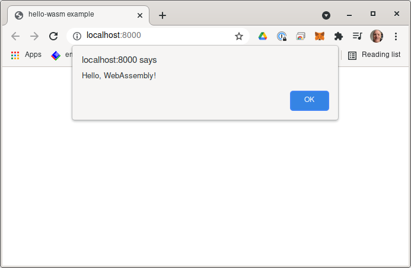

# Rust hello-wasm

A minimal rust program that is compiled to javascript and is able
to run in a browser.

From:
  https://developer.mozilla.org/en-US/docs/WebAssembly/Rust_to_wasm

## Prerequsites

- rust: https://www.rust-lang.org/install.html.
- wasm-pack: https://developer.mozilla.org/en-US/docs/WebAssembly/Rust_to_wasm#wasm-pack.
- http: [`cargo install https`](https://crates.io/crates/https) and use `http` or
  use python server as `python3 -m http.server`.

## Build
```bash
wasm-pack build --target web
```

## Run
From the [rr] run:
```bash
http .
```
And the in the browser `http://localhost:8000`. The http server should output a log like:
```
wink@3900x:~/hello-wasm (main)
$ http .
Hosting "." on port 8000 without TLS and no authentication...
Ctrl-C to stop.

[2021-09-27 16:37:54] 127.0.0.1:42922 was served file /home/wink/prgs/rust/myrepos/hello-wasm/index.html as text/html
[2021-09-27 16:37:54]                           found index file for directory /home/wink/prgs/rust/myrepos/hello-wasm
[2021-09-27 16:37:54] 127.0.0.1:42922 was served file /home/wink/prgs/rust/myrepos/hello-wasm/pkg/hello_wasm.js as application/javascript
[2021-09-27 16:37:54] Created temp dir $TEMP/http-home-wink-prgs-rust-myrepos-hello-wasm/encoded
[2021-09-27 16:37:54]                           encoded as gzip for 295.1% ratio
[2021-09-27 16:37:54] 127.0.0.1:42922 was served file /home/wink/prgs/rust/myrepos/hello-wasm/pkg/hello_wasm_bg.wasm as application/wasm
[2021-09-27 16:37:54]                           encoded as gzip for 223.2% ratio

```

And the browser should display a alert box like:


[rr]: is Repo Root so with `git clone http://github.com/winksaville/rust-hello-wasm ~/hello-wam`
rr is `~/hello-wasm`

